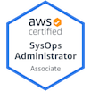

## Hey, I'm Rafa Leo!

I am Production Engineer at [Creditas](https://www.creditas.com/) and passionate by Cloud, IaC, SRE philosophy and microservices. Degree in Computer Network in 2016 by [Bandtec](https://www.sptech.school/) I'm trying to learn some stuff since then through open-source community.

## I like

- Open-source, Terraform, AWS, Kubernetes and Go.
- Coffee.
- Rappel.
- Travel

  
Some of my Public Stats

  
  

  

  
  ----
  

